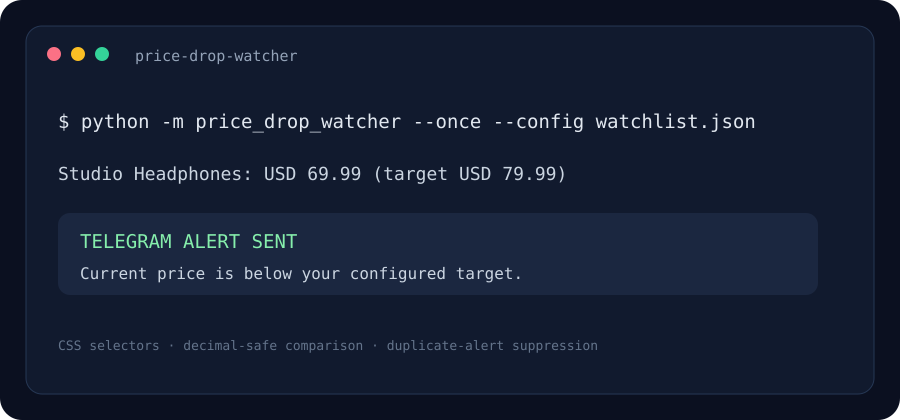

# Price Drop Watcher & Telegram Alert

A configurable product-price monitor that checks public product pages and sends a Telegram alert when a price reaches a target.

> The image above is an illustrative terminal preview.

## Problem it solves

When a product price matters, repeatedly checking its page is tedious. This project stores product URLs, CSS selectors, target prices, and currency in JSON; it checks on a schedule and remembers the last observed price to avoid repeating the same alert.

## Quick start

Requires Python 3.10 or later and a Telegram bot token plus chat ID.

~~~powershell
python -m venv .venv
.venv\Scripts\Activate.ps1
python -m pip install -r requirements.txt
Copy-Item watchlist.example.json watchlist.json
$env:TELEGRAM_BOT_TOKEN = "your-bot-token"
$env:TELEGRAM_CHAT_ID = "your-chat-id"
python -m price_drop_watcher --config watchlist.json --once
~~~

Remove the final --once to check every four hours. Change the interval with --interval-hours 1.

## Configure a product

Edit the product entry in watchlist.json. The example uses semantic HTML selectors; many shops expose a machine-readable price through an itemprop or JSON-LD script. Configure selectors for the pages you are permitted to access.

The price parser expects a number such as 79.99 or 1,299.00. Set currency to an ISO-style display label such as USD, EUR, or GBP. Do not commit credentials or your personal watchlist.

## How it works

1. Requests fetches the configured URL with a timeout and a descriptive user agent.
2. Beautiful Soup extracts title, price, and an optional product image using CSS selectors.
3. Decimal compares the price to its target without floating-point rounding.
4. A local JSON state file tracks the previous price and suppresses duplicate alerts.
5. Telegram's Bot API sends a message or a product image with a caption.

## Project layout

- **price_drop_watcher/watcher.py** — retrieval, parsing, state, and Telegram API calls.
- **watchlist.example.json** — safe configuration template with a non-routable example domain.
- **assets/preview.svg** — illustrative terminal preview.

## Tech stack

Python · requests · Beautiful Soup 4 · Decimal · Telegram Bot API · JSON

## Limitations and responsible use

Product pages change their HTML and some use JavaScript rendering, anti-bot protections, or access restrictions. Selectors may need adjustment, and this simple client does not execute page JavaScript. Check a site's terms and robots guidance before polling; keep a reasonable interval. A public product image URL is sent to Telegram when configured, and the product URL and price are included in the alert.

## License

MIT.
